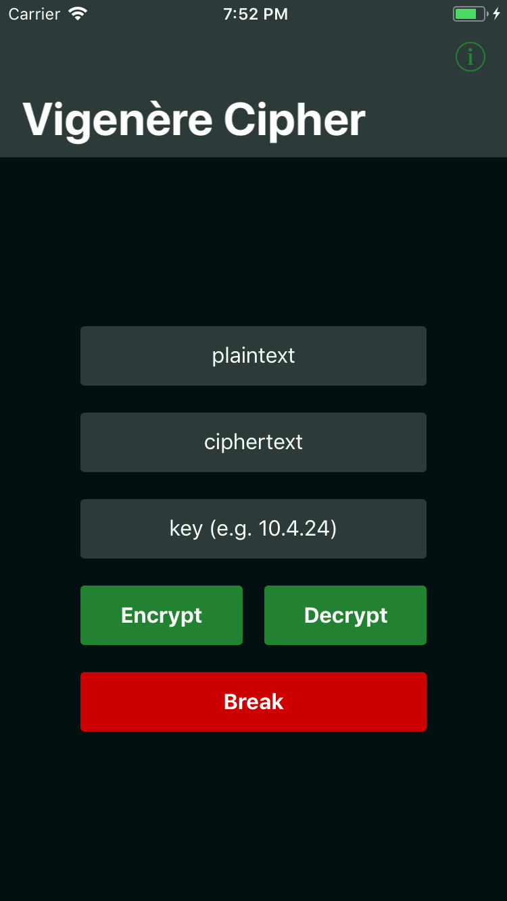

# Vigenère Cipher
This is an implementation of Vigenère Cipher on the platform iOS; written using Swift 4.

It includes a simple UI to encrypt/decrypt the given text or break one(in development) even without a key provided since Vigenère Cipher is easily decodable by the processing power provided even by today's average computers.
<<<<<<< HEAD

## Explanation of Vigenère Cipher
As always, here is the [explanation by Wikipedia](https://en.wikipedia.org/wiki/Vigenère_cipher).

However, I also found the following videos to be quite useful:
- [Vigenere Cipher - Encryption](https://www.youtube.com/watch?v=izFivfLjD5E&t=216s)
- [Vigenere Cipher - Decryption (Known Key)](https://www.youtube.com/watch?v=oHcJ4QLiiP8)
- [Vigenere Cipher - Decryption (Unknown Key)](https://www.youtube.com/watch?v=LaWp_Kq0cKs)

## Roadmap
- [ ] Develop the break functionality
- [ ] Include unit tests
=======

## Explanation of Vigenère Cipher
As always, here is the [explanation by Wikipedia](https://en.wikipedia.org/wiki/Vigenère_cipher).

However, I also found the following videos to be quite useful:
- [Vigenere Cipher - Encryption](https://www.youtube.com/watch?v=izFivfLjD5E&t=216s)
- [Vigenere Cipher - Decryption (Known Key)](https://www.youtube.com/watch?v=oHcJ4QLiiP8)
- [Vigenere Cipher - Decryption (Unknown Key)](https://www.youtube.com/watch?v=LaWp_Kq0cKs)

## Roadmap
- [ ] Develop the break functionality
- [ ] Include unit tests
